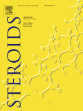
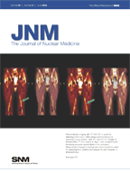
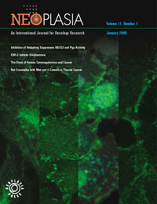
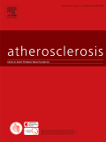
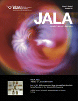

# Christopher Tong List of Selected Publications and Abstracts

## Statistical Applications

Grouped in the following categories: veterinary microbiology; medical imaging; mass spectrometry.

### Veterinary Microbiology

 
 
#### Journal Publications (Refereed)

- A. L. Ingebritson, C. P. Gibbs, C. Tong, and G. B. Srinivas, 2015:  [A PCR detection method for testing mycoplasma contamination of veterinary vaccines and
biological products](https://doi.org/10.1111/lam.12355).  *Letters in Applied Microbiology*, **60**: 174-180.

#### Conference Abstract

- J. V. Warg, K. Snekvik, C. Loiacono, and C. Tong, 2017:  Aquatic animal disease proficiency testing added to the U.S. National Animal Health Laboratory 
Network.  *European Association of Fish Pathologists, 18th International Conference on Diseases of Fish and Shellfish*, 4-8 September 2017, Belfast, N.I., U.K.  179-P.

### Medical Imaging

Modalities:  Ultrasound (B-mode and Doppler), MRI, CT, PET.

Therapeutic areas:  cardiovascular diseases, steroids, oncology.

    

#### Journal Publications (Refereed)

- K. Azer, M. C. Desiderio, C. Tong, M. Bunzel, B. R. Campbell, D. Shevell, and M. Walker III, 2010: [High throughput Doppler toolbox for preclinical 
drug development](https://doi.org/10.1016/j.jala.2009.12.002).  *Journal of the Association for Laboratory Automation*, **15**: 287-296.

- H. Tang, J. R. Vasselli, C. Tong, S. B. Heymsfield, and E. X. Wu, 2009:  [In vivo MRI evaluation of anabolic steroid precursor growth 
effects in a guinea pig model](https://doi.org/10.1016/j.steroids.2009.02.012). *Steroids*, **74**: ~684-693.  :lock:

- M. Walker III,  B. R. Campbell,  K. Azer, C. Tong, K. Fang, J. J. Cook, M. J. Forrest,  K. Kempadoo, S. D. Wright, J. S. Saltzman,  E. MacIntyre, 
and R. Hargreaves, 2009: [A novel 3-dimensional micro-ultrasound approach to automated measurement of carotid arterial plaque volume as a biomarker 
for experimental atherosclerosis](https://doi.org/10.1016/j.atherosclerosis.2008.09.013).  *Atherosclerosis*, **204**: 55-65.  :lock:

- B. B. Haines, K. A. Bettano, M. Chenard, R. S. Sevilla, C. Ware, M. H. Angagaw, C. T. Winkelmann, C. Tong, J. F. Reilly, C. Sur,  and W. Zhang, 2009: [A 
quantitative volumetric micro-computed tomography method to analyze lung tumors in genetically engineered mouse models](https://doi.org/10.1593/neo.81030).  *Neoplasia*, **11**: 39-47.

- J. H. F. Rudd, K. S. Myers, S. Bansilal, J. Machac, C. A. Pinto, C. Tong, A. Rafique, R. Hargreaves, M. Farkouh, V. Fuster, and Z. A. Fayad, 2008:  [Atherosclerosis 
inflammation imaging with 18F-FDG PET:  carotid, iliac and femoral uptake reproducibility, quantification methods, and recommendations](https://doi.org/10.2967/jnumed.107.050294).  *Journal of Nuclear Medicine*, **49**:  871-878.

- E. X. Wu, H. Tang, C. Tong, S. B. Heymsfield, and J. R. Vasselli, 2008:  [In vivo MRI quantification of individual muscle and organ volumes for assessment 
of anabolic steroid growth effects](https://doi.org/10.1016/j.steroids.2007.12.011).  *Steroids*, **73**:  430-440.  :lock:

#### Conference Abstracts

- R. S. Sevilla, K. A. Bettano, B. B. Haines, M. Chenard, C. Ware, M. H. Angagaw, C. T. Winkelmann, C. Tong, J. F. Reilly, C. Sur, and W. Zhang, 2009:  [Volumetric 
quantification of lung tumors using micro-CT in complex genetically engineered mouse models](wmic2009ex.PNG).  *2009 World Molecular Imaging Congress*, 23-26 September 2009, 
Montreal, Quebec, Canada.  1007.

- C. Tong, 2009:  [Validation of MRI measurement of muscle and organ volume in guinea pigs](icsa2009ex.PNG).  *International Chinese Statistical Association 2009 Applied
Statistics Symposium*, 21-24 June 2009, San Francisco, CA.

- H. Tang, R. H. Chang, D. L. Suresch, L. A. McNamara, C. Tong, B. Misselwitz, D. Zhou, B. M. Connolly, J. Xu, X. Chen, X. Shen, C. Zhang, E. L. Rickes, 
M. A. Mariano, K. Azer, J. Wang, C. Sur, D. S. Williams, M. Klimas, A. S. Plump, R. J. Hargreaves, and H. Liu, 2009:  [In vivo volumetric MRI in drug discovery: a
preclinical case study of the ezetimibe therapeutic efficacy on atherosclerosis in the thoracic ascending arterial tree in ApoE-/- mice](https://cds.ismrm.org/protected/09MProceedings/files/00030.pdf).  *International Society 
For Magnetic Resonance In Medicine 17th Scientific Meeting and Exhibition*, 18-24 April 2009, Honolulu, Hawaii.  *Proceedings of the International Society For
Magnetic Resonance In Medicine*, vol. 17, Session:  Coronaries & Aorta:  Lumen & All, 30.

- H. Tang, C. H. Chang, D. L. Suresch, L. A. McNamara, B. Misselwitz, D. Zhou, B. M. Connolly, C. Tong, E. L. Rickes, X. Shen, C. Sur, D. S. Williams, 
M. Klimas, R. J. Hargreaves, and H. Liu, 2008:  [In vivo quantitation of atherosclerotic plaque burden in mice by MRI: mapping plaque progression and regression in
response to therapies in the entire ascending arterial tree in thoracic cavity](atvb2008excerpt.PNG).  American Heart Association's *Arteriosclerosis, Thrombosis and Vascular Biology Annual Conference*, 
16-18 April 2008, Atlanta, Georgia.  P469.  *Arteriosclerosis, Thrombosis and Vascular Biology*, **28**:  E118.

- M. Bunzel, B. R. Campbell, K. Azer, C. Tong, S. Ramcharan, K. Saini, C. Fancourt, S. Wang, and M. Walker III, 2008:  [3D-micro-ultrasound documents 
Diltiazem mediated changes in central aortic hemodynamics](https://faseb.onlinelibrary.wiley.com/doi/10.1096/fasebj.22.1_supplement.587.2).  *Experimental Biology*, 5-9 April 2008, San Diego, California.  *FASEB Journal*, **22**, 587.2.

- C. Tong, K. Azer, M. C. Desiderio, K. Saini, S. L. Ramcharan, M. M. Bunzel, B. R. Campbell, K. A. Parsons, M. Walker III, and D. Shevell, 2007: [Validation 
of semi-automated Doppler ultrasound image processing to compute hemodynamic biomarkers](https://meetings.siam.org/sess/dsp_talk.cfm?p=23482).  *Society for Industrial and Applied Mathematics Conference on 
Mathematics for Industry*, 9-11 October 2007, Phildadelphia, Pennsylvania.  

- K. Azer, M. C. Desiderio, M. Walker III, S. L. Ramcharan, C. Tong, M. M. Bunzel, and D. Shevell, 2007: [Semi-automated Doppler toolbox for integrated 
hemodynamic analysis](https://meetings.siam.org/sess/dsp_talk.cfm?p=23499). *Society for Industrial and Applied Mathematics Conference on Mathematics for Industry*, 9-11 October 2007, Phildadelphia, Pennsylvania.  

- C. Tong, Y. Tymofyeyev, K. Azer, P. E. Brandish, H. Chen, J. C. Hershey, M. Walker III, B. R. Campbell, K. Fang, D. S. Williams, and A. Coimbra, 2006: [Biomarker 
analysis of medical imaging and radiotelemetry signals](jsm2006excerpt.PNG). *Joint Statistical Meetings 2006*, 6-10 August 2006, Seattle, Washington. 

### Mass Spectrometry

#### Conference Paper (Refereed)

- C. Tong and V. Svetnik, 2002:  [Novelty detection in mass spectral data using a support vector machine method](excerpt_interface2002.pdf).  *Thirty-fourth Interface Symposium*, 
17-20 April 2002, Montreal, Quebec, Canada. *Computing Science and Statistics*, **34**: 515-521.

#### Conference Abstract

- G. S. Jackson, L. A. Spence, D. Elmore, B. R. Martin, C. Tong, G. McCabe, M. A. Rounds, and C. M. Weaver, 2002:  [Development of a precise, accurate, and 
rapid measure of bone resorption using accelerator mass spectrometry](faseb2002excerpt.PNG). *Experimental Biology 2002*, 20-24 April 2002, New Orleans, Louisiana. *FASEB 
Journal*, **16** (4), A224.

### Notes

FASEB = Federation of American Societies for Experimental Biology.

