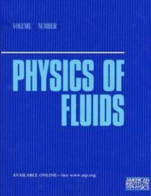
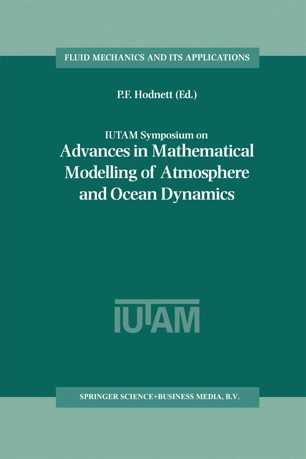
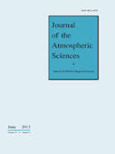
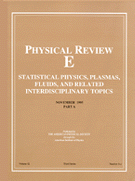
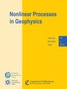
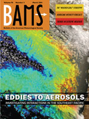

# Theoretical Modeling of Hydrodynamics

Low-order models in the form of coupled gyrostats, applied to 2D and 3D Rayleigh-Benard convection (including either spontaneously-generated or externally-forced vertical shear), magnetoconvection, and other hydrodynamic flows.

     

## Journal Publications (Refereed)

- C. Tong and A. Gluhovsky, 2008:  [Gyrostatic extensions of the Howard-Krishnamurti model of thermal convection with shear](https://doi.org/10.5194/npg-15-71-2008).  *Nonlinear Processes in Geophysics*, **15**: 71-79.

- C. Tong and A. Gluhovsky, 2002:  [Energy-conserving low-order models for three-dimensional Rayleigh-Benard convection](https://doi.org/10.1103/PhysRevE.65.046306).  *Physical Review E:  Statistical, Nonlinear, and Soft Matter Physics*, **65**: 046306.  :lock:

- A. Gluhovsky, C. Tong, and E. Agee, 2002:  [Selection of modes in convective low-order models](https://doi.org/10.1175/1520-0469(2002)059<1383:SOMICL>2.0.CO;2
).  *Journal of the Atmospheric Sciences*, **59**: 1383-1393.

- A. Gluhovsky and C. Tong, 1999:  [The structure of energy conserving low-order models](https://doi.org/10.1063/1.869883).  *Physics of  Fluids*, **11**: 334-343.  :lock:

  - Errata:  p. 342, Fig. 3 caption, line 3:  replace "Eq. (26)" with "Eq. (28)".

## Conference Papers (Unrefereed)

- A. Gluhovsky, C. Tong, and E. Agee, 2001:  [Energy conserving low-order models for potential vorticity dynamics and convection with shear](https://ams.confex.com/ams/13FLUID/webprogram/Paper21040.html).  *American Meteorological Society 13th Conference on Atmospheric and Oceanic Fluid Dynamics*, 4-8 June 2001, Breckenridge, Colorado, 117-121.

- A. Gluhovsky and C. Tong, 2001:  [Low-order models of atmospheric dynamics with physically sound behavior](https://doi.org/10.1007/978-94-010-0792-4_17). *IUTAM Symposium on Advances in Mathematical Modelling of Atmosphere and Ocean Dynamics, Proceedings*, 2-7 July 2000, Limerick, Ireland; P. F. Hodnett (ed.). *Fluid Mechanics and its Applications*, vol. 61. Dordrecht, Netherlands: Kluwer, 147-152.  :lock:

  - IUTAM = International Union of Theoretical and Applied Mechanics.

- A. Gluhovsky and C. Tong, 2000:  [Low-order models of a sheared convective boundary layer](aspen2000.pdf).  *American Meteorological Society 14th Symposium on Boundary Layer and Turbulence*, 7-11 August 2000, Aspen, Colorado, 206-209.

## Conference Abstracts (Unrefereed)

- C. Tong and A. Gluhovsky, 2002:  [An energy-conserving low-order model for 3D thermal convection](http://flux.aps.org/meetings/YR02/MAR02/baps/abs/S270005.html).  *Annual March Meeting of the American Physical Society*, 18-22 March 2002, Indianapolis, Indiana, A27.5.  *Bulletin of the American Physical Society*, **47** (1), 107.

- A. Gluhovsky and C. Tong, 2001:  [Physically motivated Galerkin approximations in geophysical fluid dynamics](http://flux.aps.org/meetings/YR01/DFD01/abs/S420007.html). *American Physical Society 54th Annual Meeting of the Division of Fluid Dynamics*, 18-20 November 2001, San Diego, California, DL 7.  *Bulletin of the American Physical Society*, **46** (10), 82.

- C. Tong and A. Gluhovsky, 2001:  Modeling fluid flow with gyrostats.  *Indiana Section of the Mathematical Association of America Fall 2001 Meeting*, 20 October 2001, West Lafayette, Indiana.

- A. Gluhovsky and C. Tong, 1999:  [Nonlinear models in geophysical fluid dynamics in the form of coupled gyrostats](egs1999ex.PNG).  *Twenty-fourth General Assembly of the European Geophysical Society*, 19-23 April 1999, The Hague, Netherlands.  *Geophysical Research Abstracts*, **1**, 810.

- C. Tong and A. Gluhovsky, 1999:  [Gyrostatic low-order models in fluid dynamics](http://flux.aps.org/meetings/YR99/CENT99/abs/S9145012.html).  *Centennial Meeting of the American Physical Society*, 20-26 March 1999, Atlanta, Georgia, YC06.12.  *Bulletin of the American Physical Society*, **44** (1), 1826.

- A. Gluhovsky and C. Tong, 1998:  [The structure of energy conserving low-order models in geophysical fluid dynamics](rossby100.pdf). *The Rossby-100 Symposium*, 8-12 June 1998, Stockholm, Sweden, **1**, 128-130.

## Letters to the Editor

- A. Gluhovsky and C. Tong, 2014:  [Comments on "Analogies of ocean/atmosphere rotating fluid dynamics with gyroscopes:  teaching opportunities"](https://doi.org/10.1175/BAMS-D-13-00166.1).  [Response to Thomas W.N. Haine and D.A. Cherian.]  *Bulletin of the American Meteorological Society*, **95**: 445-446.

- A. Gluhovsky and C. Tong, 2012:  [Comments on "Modeling of chaotic motion of gyrostats in resistant environment on the base of dynamical systems with strange attractors"](https://doi.org/10.1016/j.cnsns.2011.11.019).  [Response to Anton V. Doroshin.]  *Communications in Nonlinear Science and Numerical Simulation*, **17**: 3112-3113.  :lock:

 

## Principal collaborators

- Dr. [Alexander B. Gluhovsky](https://www.eaps.purdue.edu/people/profile/aglu.html), Professor Emeritus, Dept. of Earth, Atmospheric, and Planetary Sciences, and Dept. of Statistics, Purdue University.
- Dr. [Ernest M. Agee](https://www.eaps.purdue.edu/people/profile/eagee.html), Professor Emeritus and former Head, Dept. of Earth, Atmospheric, and Planetary Sciences, Purdue University.
  - [A Golden Academic Adventure](https://www.eaps.purdue.edu/news/articles/2021/1006_agee.html)
- Dr. [Suzanne M. Zurn-Birkhimer](https://www.purdue.edu/wiep/AboutUs/WIEP%20Administration.html#collapseTwo), Associate Director, Women in Engineering Program; and courtesy Associate Professor, Dept. of Earth, Atmospheric, and Planetary Sciences, Purdue University.
- Dr. [Daniel T. Dawson II](https://www.eaps.purdue.edu/people/profile/dawson29.html), Assistant Professor, Dept. of Earth, Atmospheric, and Planetary Sciences, Purdue University.

(c) 2022 by Christopher Tong
