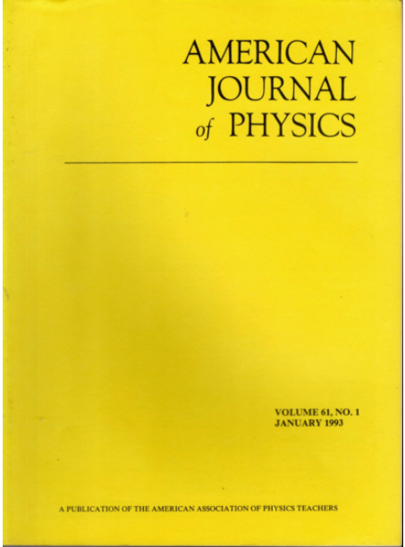
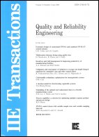

# Miscellaneous Correspondence and Commentary

    

## Expository

- C. Tong, 2021:  [The statistical endeavors of Andrew Carnegie](https://doi.org/10.1080/09332480.2021.2003633).  *Chance*, **34** (4), 12-17.  :lock:

  - Erratum:  The beginning of the third to last paragraph on the last page should read:  "By contemporary standards, Andrew Carnegie is not a statistician, nor would his modern counterparts--CEOs of modern companies--be considered statisticians..."

## Book Review

- C. Tong, 2005:  [Book review](https://doi.org/10.1080/07408170500232784) of *Methods of Multivariate Analysis*, second edition, by Alvin C. Rencher.  *IIE Transactions*, **37**, 1083-1085.  :lock:

  - IIE = Institute of Industrial Engineers.

## Letters to the Editor

- C. Tong, 2015:  [Response](https://magazine.amstat.org/blog/2015/05/01/sciencenotartii/) to Mark van der Laan, "Statistics as a science, not an art:  the way to survive in data science".  *Amstat News*, issue 455 (May 2015), 34-35.

- C. Tong, 2012:  [Response](https://doi.org/10.1080/00031305.2012.667900) to H. A. David, "Euler's contributions to mathematics useful in statistics".  *The American Statistician*, **66**: 75.

- C. Tong, 2004:  [Parallel universes in the statistics literature](https://doi.org/10.1119/1.1789165). [Response to Derek York, Norman M. Evensen, Margarita Lopez Martinez, and Jonas de Basabe Delgado.]  *American Journal of Physics*, **72**: 1367.

- C. Tong, 2003:  [Further comments on the review times for statistics and physics journals](ims_bull_excerpt.pdf).  [Response to Larry Wasserman.]  *IMS Bulletin*, **32** (4): 10.

  - IMS = Institute of Mathematical Statistics.

- C. Tong, 2002:  [Various formulations of classical mechanics](https://doi.org/10.1119/1.1479745). [Response to Daniel F. Styer et al.]  *American Journal of Physics*, **70**: 664.  :lock:

- C. Tong, 2001: [Physics and quality](ind_phys_excerpt.pdf). [Repsonse to Mark Annett.]  *The Industrial Physicist*, **7** (3), 4.

- C. Tong, 1996:  [Torsional pendulums and SQUIDs](https://doi.org/10.1119/1.18352).  [Response to Randall D. Peters.]  *American Journal of Physics*, **64**: 1227-1228.  :lock:

- C. Tong, 1995:  [Answer](https://doi.org/10.1119/1.17963) to Question #4, "Is there a physics application that is best analyzed in terms of continued fractions?".  [Repsonse to Dwight E. Neuenschwander.]  *American Journal of Physics*, **63**: 109.

