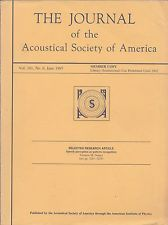
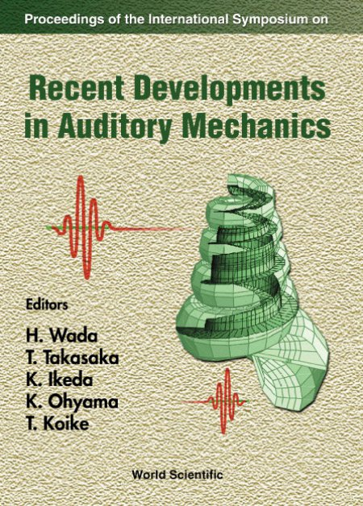

# Theoretical Modeling of Otoacoustic Emissions

   

## Journal Publications (Refereed)

- C. L. Talmadge, A. Tubis, G. R. Long, and C. Tong, 2000:  [Modeling the combined effects of basilar membrane nonlinearity and roughness on stimulus frequency otoacoustic emission fine structure](https://doi.org/10.1121/1.1321012). *Journal of the Acoustical Society of America*, **108**: 2911-2932.  :lock:

- A. Tubis, C. L. Talmadge, C. Tong, and S. Dhar, 2000: [On the relationships between the fixed-f_1, fixed-f_2 and fixed-ratio phase derivatives of the 2f_1 -f_2 
distortion product otoacoustic emission](https://doi.org/10.1121/1.1310666). *Journal of the Acoustical Society of America*, **108**:  1772-1785.  :lock:

- A. Tubis, C. L. Talmadge, and C. Tong, 2000:  [Modeling the temporal behavior of distortion product otoacoustic emissions](https://doi.org/10.1121/1.428493).  *Journal of the Acoustical Society of America*, **107**:  2112-2127.  :lock:

## Conference Paper (Unrefereed)

- C. L. Talmadge, A. Tubis, C. Tong, G. R. Long, and S. Dhar, 2000:  [Temporal aspects of otoacoustic emissions](https://www.mechanicsofhearing.org/mohdl/pdfs/MoH/MoH1999/Talmadge-etal-MoHProceedings-1999.pdf). *Proceedings of the International Symposium on Recent Developments in Auditory
Mechanics*, 25-30 July 1999, Sendai, Japan; H. Wada, T. Takasaka, K. Ikeda, K. Ohyama, and T. Koike (eds.).  Singapore:  World Scientific, 353-359.

  - This conference is part of the [Mechanics of Hearing Workshops](https://mechanicsofhearing.org/).

## Conference Abstracts

- C. Talmadge, A. Tubis, and C. Tong, 2001:  [Cochlear wave reflection due to roughness in 2-d and 3-d cochlear models](aro2001ex.PNG).  *Twenty-fourth Midwinter Research Meeting of the Association for Research in Otolaryngology*, 4-8 February 2001, St. Petersburg Beach, Florida, 44. *Association for Research in Otolaryngology Abstracts*, **24**: 12.

- A. Tubis, C. Talmadge, G. Long, S. Dhar, and C. Tong, 2000: [Amplitude and group-delay finestructures of distortion product otoacoustic emissions as functions of primary levels and frequency ratios](aro2000ex.PNG).  *Twenty-third Midwinter Research Meeting of the Association for Research in Otolaryngology*, 20-24 February 2000, St. Petersburg Beach, Florida, 483. *Association for Research in Otolaryngology Abstracts*, **23**: 139.

- C. L. Talmadge, A. Tubis, C. Tong, and G. R. Long, 1999:  [Temporal behavior of distortion product  otoacoustic emissions](aro1999ex.PNG). *Twenty-second Midwinter Research Meeting 
of the Association for Research in Otolaryngology*, 13-18 February 1999, St. Petersburg Beach, Florida, 404.   *Association for Research in Otolaryngology Abstracts*, **22**: 102.

## Principal Collaborators

- Dr. [Arnold Tubis](https://www.physics.purdue.edu/people/faculty/atu.php), Professor Emeritus and former Head, Dept. of Physics, Purdue University.
- Dr. Glenis R. Long (1943-2021), Professor Emerita, Program in Speech-Language-Hearing-Sciences, The Graduate Center, City University of New York.
  - [In memoriam](https://www.gc.cuny.edu/news/memoriam-professor-emerita-glenis-r-long).
- Dr. [Carrick L. Talmadge](https://olemiss.edu/profiles/clt.php), Senior Research Scientist II, National Center for Physical Acoustics; and Research Associate Professor of Communication Sciences & Disorders, University of Mississippi.
- Dr. [Sumitrajit (Sumit) Dhar](https://communication.northwestern.edu/faculty/sumitrajit-dhar/), Professor and former Chair, Dept. of Communication Sciences and Disorders; Fellow, Hugh Knowles Center; and Associate Provost for Faculty, Northwestern University.
- Dr. [Lauren A. Shaffer](https://www.bsu.edu/academics/collegesanddepartments/spaa/about-us/directory/shafferlauren), Associate Professor and former Interim Chair, Dept. of Speech Pathology and Audiology, Ball State University.

(c) 2022-2026 by Christopher Tong
