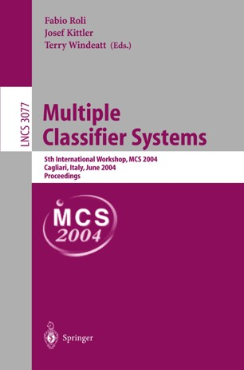
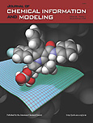
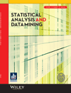

# Empirical Modeling of Quantitative Structure-Activity Relationships (QSAR)

Machine learning methods used: random forest; stochastic gradient boosting; association rule learning.

   

## Journal Publications (Refereed)

- J. Ma, C. Tong, A. Liaw, R. Sheridan, J. Szumiloski, and V. Svetnik, 2009:  [Generating hypotheses about molecular structure-activity relationships (SARs) by 
solving an optimization problem](https://doi.org/10.1002/sam.10040).  *Statistical Analysis and Data Mining*, **2**: 161-174.  :lock:

  - Published in the *Special Issue on Chemogenomics, Part II*.

- V. Svetnik,  T. Wang, C.  Tong, A. Liaw, R. P. Sheridan, and Q. Song, 2005:  [Boosting:  an ensemble learning tool for compound classification and QSAR 
modeling](https://doi.org/10.1021/ci0500379). *Journal of Chemical Information and Modeling*, **45**:  786-799.  :lock:

- V. Svetnik, A. Liaw, C.  Tong, J. C. Culberson, R. P. Sheridan, and B. P. Feuston, 2003:  [Random forest:  a classification and regression tool for 
compound classification and QSAR modeling](https://doi.org/10.1021/ci034160g). *Journal of Chemical Information and Computer Sciences*, **43**: 1947-1958.  :lock:

  - This is by far the most frequently cited journal paper I have co-authored.

## Conference Papers (Refereed)

- V. Svetnik, A. Liaw, C. Tong, and T. Wang, 2004:  [Application of Breiman's random forest to modeling structure-activity relationships of pharmaceutical 
molecules](https://doi.org/10.1007/978-3-540-25966-4_33).  *Multiple Classifier Systems, Fifth International Workshop, MCS 2004, Proceedings*, 9-11 June 2004, Cagliari, Italy; F. Roli, J. Kittler, and T. Windeatt (eds.).  *Lecture Notes in Computer Science*, vol. 3077. Berlin: Springer, 334-343.  :lock:

   - This is by far the most frequently cited conference paper I have co-authored.

## Conference Papers (Unrefereed)

- V. Svetnik, A. Liaw, and C. Tong, 2004:  [Variable selection in random forest with application to quantitative structure-activity relationship](https://www.researchgate.net/profile/Vladimir_Svetnik/publication/228572061_Variable_Selection_in_Random_Forest_with_Application_to_Quantitative_Structure-Activity_Relationship/links/00b495321cca0aa7d3000000/Variable-Selection-in-Random-Forest-with-Application-to-Quantitative-Structure-Activity-Relationship.pdf).  *IIASS International School on Neural Nets "E. R. Caianiello" 7th Course:  Ensemble Methods for Learning Machines*, 22-28 September 2002, Vietri sul Mare, Salerno, Italy.  (I am not certain of the accuracy of this citation.)

- C. Tong, V. Svetnik, and A. Liaw, 2003:  [Quantitative structure-activity-relationship modeling using Leo Breiman's random forest](JSM2003-000025.pdf). 
*Joint Statistical Meetings 2003*, 3-7 August 2003, San Francisco, California.  *American Statistical Association 2003 Proceedings*, Section on 
Physical and Engineering Sciences, 4263-4266.

  - Runner-up for the JSM 2003 Oustanding Presentation Award, from the ASA Section on Physical and Engineering Sciences.

## Conference Abstracts

- M. Torrent, C. Tong, A. Liaw, R. Nachbar, Y. Gao, R. Mosley, and C. Culberson, 2007:  Molecular modeling-assisted attenuation of undesirable PXR 
activity.  *In Silico ADMET Conference:  The Role of Protein-Structure Information in ADMET Prediction*, 16-17 May 2007, London, U.K.

- A. Liaw, C.Tong, T.-C. Wang, and V. Svetnik, 2006:  [How to find drugs with trees:  applications of ensemble methods in QSAR 
modeling](enar2006ex.PNG).  *2006 ENAR Spring Meeting*, 26-29 March 2006, Tampa, FL. 

  - ENAR = Eastern North American Region of the International Biometric Society.

- S. Ha, C. Tong, R. Perlow-Poehnelt, J. H. Lin, J. C. Culberson, R. P. Sheridan, and J. Hochman, 2005:  QSAR models for predicting 
p-glycoprotein activity of antagonists for a GPCR target. *230th American Chemical Society National Meeting and Exposition*, 28 August - 1 September 2005, 
Washington, D.C., MEDI 146A.22.

- V. Svetnik, T. Wang, C. Tong, and A. Liaw, 2005:  [Application of ensemble learning for modeling of quantitative structure-activity relations of 
pharmaceutical molecules](interface2005ex.PNG). *Joint Annual Meeting of the Interface Foundation of North America and the Classification Society of North America*, 8-12 June 2005, Saint Louis, Missouri.  

- C. Tong, V. Svetnik, A. Liaw, R. P. Sheridan, J. C. Culberson, B. P. Feuston, R. Evers, and D. Hartley, 2003:  [QSAR prediction of ADME parameters 
using a new machine learning tool--random forest](predictive_adme_excerpt.PNG).  *Predictive ADME*, 17-18 November 2003, Boston, Massachusetts.

### Notes

ADME = Absorption, Distribution, Metabolism, and Excretion.  

ADMET = same, except add Toxicity.
