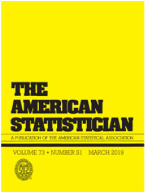
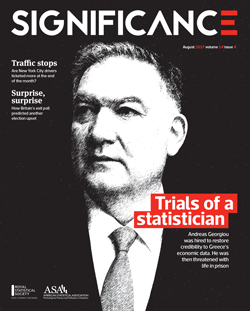

# Philosophy and Principles of Statistical Practice

 

- C. Tong, 2019:  [Statistical inference enables bad science; statistical thinking enables good science](https://doi.org/10.1080/00031305.2018.1518264).  *The American Statistician*, **73** (Sup 1): 246-261.  

  - Published in the special issue on *Statistical Inference in the 21st Century: A World Beyond p < 0.05*.
  
  - Discussed on Andrew Gelman's blog, *Statistical Modeling, Causal Inference, and Social Science* [here](https://statmodeling.stat.columbia.edu/2019/09/16/harking-sharking-tharking/) and especially [here](https://statmodeling.stat.columbia.edu/2019/09/17/statistical-inference-enables-bad-science-statistical-thinking-enables-good-science/).  After expressing some concerns and disagreements, he writes:  "Overall, though, I agree with Tong’s message, and I think everybody should read his article."

  - [R. Picard and D. Osthus (2022)](https://www.medrxiv.org/content/10.1101/2022.04.29.22274494v1) call this paper "an insightful historical review of overconfident statistical inference."  This paper has also been cited by a few other statisticians such as [Yihui Xue (2019)](https://slides.yihui.org/2019-ISU-mental.html#43) and [Sander Greenland (2023)](https://onlinelibrary.wiley.com/doi/epdf/10.1111/sjos.12645), though the latter misspelled my name as "Toh".  Gang (John) Xie favorably discussed this paper in *Amstat News* ([December, 2024 issue](https://magazine.amstat.org/blog/2024/12/02/a-practicing-statisticians-plea/)).  However most of this paper's citations (as I intended and hoped) are by non-statisticians.
 
  - On the other hand, this paper has attracted fierce criticism, particularly from Deborah Mayo (especially [here](https://errorstatistics.com/2024/08/26/dont-divorce-statistical-inference-from-statistical-thinking-some-exchanges/)) and by the editor of the *International Encyclopedia of Statistical Science* (2d ed., Springer, 2025), Miodrag Lovric, in an article he placed in his encyclopedia (pp. 2847-2856).  The back-and-forth discussion on Prof. Mayo's blog was substantive, but she won the argument by blocking my ability to post further responses.  Nobel Peace Prize-nominee Prof. Lovric's alleged "comprehensive rebuttal" fails to engage in a single one of the arguments advanced in my paper, while demonstrating a profound unfamiliarity with the history of science.
  
  - Presented at the the *41st Midwest Biopharmaceutical Statistics Workshop*, 14-16 May 2018, Indianapolis, IN.
  
  - Presented at the *Nevada Chapter of the American Statistical Association, 2017 Annual Symposium and Meeting*, 14 October 2017, Reno, NV.

- B. Gunter and C. Tong, 2017:  [What are the odds!?  The "airport fallacy" and statistical inference](https://doi.org/10.1111/j.1740-9713.2017.01057.x).  *Significance*, **14** (4): 38-41.

  - B. Gunter and C. Tong, 2018:  [Reply to John A. Lewis](GunterAndTong_2018replyToLewis.pdf).  *Significance*, **15** (1): 46-47.

  - B. Gunter and C. Tong, 2017:  [Reply to Justin Smith](GunterAndTong_2017replyToSmithextr.pdf). *Significance*, **14** (6): 46.
  

(c) 2022-2025 by Christopher Tong
